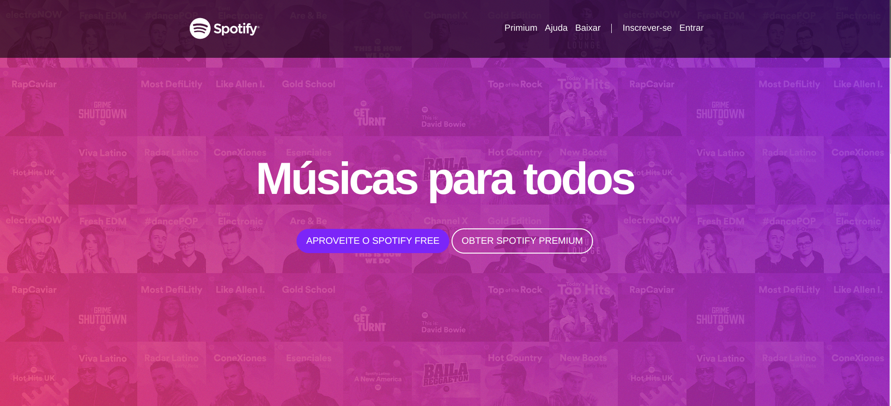
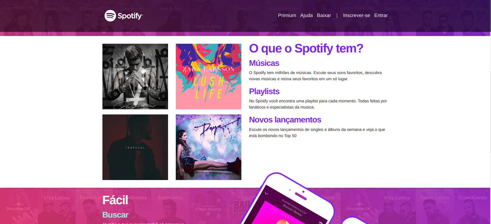
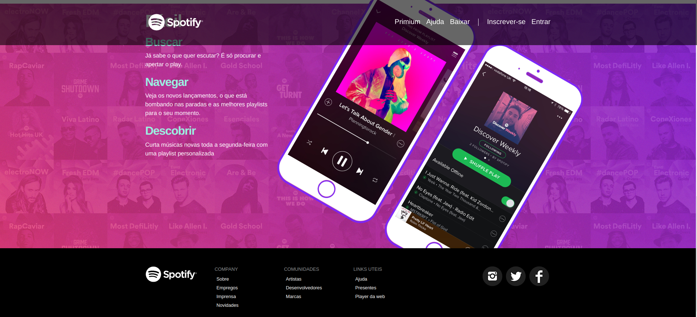
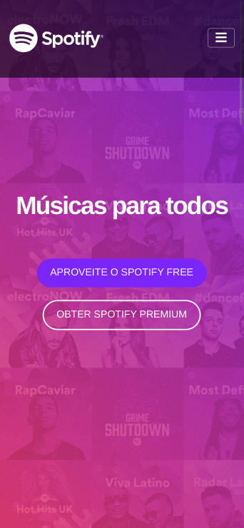
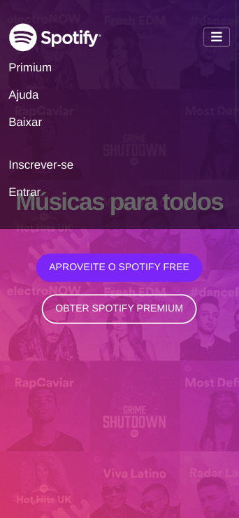
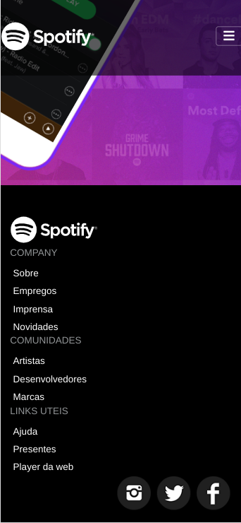

# Resumo do Projeto

Este projeto tem como objetivo aprimorar habilidades em HTML e Bootstrap por meio da criação de uma landing page que replica o layout antigo do Spotify. Através da utilização dessas tecnologias, pretende-se recriar fielmente o design clássico da plataforma de streaming de música.

Ao longo do projeto, serão explorados os recursos oferecidos pelo HTML para estruturar e organizar o conteúdo da página, como tags semânticas, elementos de formulário e estruturação de listas. O Bootstrap será utilizado para otimizar a responsividade do layout, garantindo uma experiência consistente em diferentes dispositivos e tamanhos de tela.

A replicação do layout antigo do Spotify envolverá a criação de seções principais, como cabeçalho, lista de músicas, destaques e rodapé, bem como a aplicação de estilos e classes do Bootstrap para alcançar a aparência desejada. Também será necessário trabalhar com imagens, ícones e cores específicas do design original.

Ao final do projeto, espera-se ter a landing page replicando com precisão o layout antigo do Spotify, com destaque para a fidelidade visual e a implementação adequada dos elementos de interação presentes na versão original. Esse projeto servirá como uma ótima oportunidade para aprimorar habilidades em HTML, Bootstrap e design responsivo, além de consolidar conhecimentos em desenvolvimento front-end.

## deploy

link surge:

## Desktop

## Mobile

